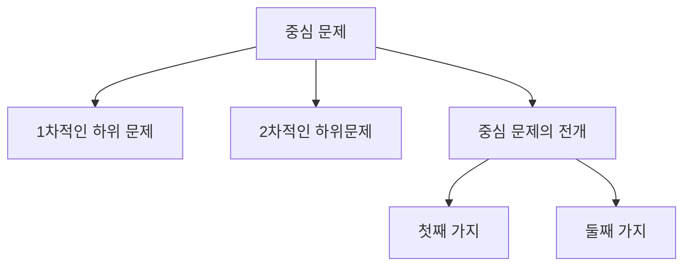

> [!abstract] 구조화된 글쓰기 또는 생각을 잘하는 법
> 논문을 쓴다는 것은 구조화된 글쓰기 또는 생각을 하는 법과 유사한 행위다. 구조화된 행위를 해야하는 이유는 1) 자신의 결과물에 공신력을 부여하고 2) 해당 결과가 타인의 참고자료가 될 수 있도록 하기 위함이다. 그런 관점에서 꾸준한 훈련을 위해 이 책을 읽었다. 여기서 배운 내용을 정리해 내 자산으로 삼고자 한다

# 1 책 요약
논문쓰는법 이라는 제목에서 알 수 있듯 논문을 잘 쓰는 방법에 대해서 이야기 하고있다. 이탈리아인들이 이탈리아에서 논문쓸때 유의할 점을 이야기 하는 책이다. 그러나 한국의 상황과 상당히 유사한 점이 많으며, 인용 형식을 제외하면 빼놓을 것이 거의 없는 책이다. 문괴적 논문에 조금은 초점이 놓여있지만 이공계 논문을 위해서도 충분히 좋은 책이었다.

# 2 인상적인 구절
- *"논문을 억지로 써야하는 경우도 있다는 걸 ... 그들은 먼저 두 가지 일을 할 수 있으리라 ... (1)다른사람이 대신 논문을 써주도록 합당한 금액을 투자하는 것, (2) 몇 년 전에 다른 대학에서 이미 만들어진 논문을  베끼는 것이다."* - 25페이지
- *"논문을 작성한다는 것은 자신의 개념을 체계화하고 자료를 정리하는 방법을 배운다는 것 ... 그러므로 테마보다는 그 논문에 수반되는 작업의 경험이 더 중요하다"* - 26페이지
- *"...파노라마식 논문으로는 학생은 가능한 모든 반박앞에 노출..."* - 30페이지
- *"...범위가 줄어들며, 무엇을 다루고 무엇을 무시해도 될지 알 수 있다"* - 33페이지
- *"...**==분야를 제한할수록 작업은 더욱 잘 이루어지고 더욱 확실하게 진행된다==**"* - 34페이지
- *"...**==논문 작성에는 ... 3년 이상도 안 되 6개월 이하도 안 된다. 3년 이상은 안된다.==**"* - 39페이지
- *"학생이 어느 교수에게 접근할 때에는 ... 그 교수에 대한 친구의 이야기를 듣고 ... 졸업한 사람들과 접촉을 하고... 그가 자기 협력자들을 자주 인용하는지 아닌지..."* - 66페이지
- *"대게 테마를 수락할 때는 ... (1) 어디에서 찾을 수 있는지, (2) 쉽게 접근할 수 있는지, (3) 내가 그것들을 마음대로 다룰 수 있는지 알고 있어야 한다"* - 71페이지
- *"각각의 책마다 카드로 정리하는 것"* - 84페이지
- *"졸업 논문 작업을 시작하는 단계에서 가장 먼저 해야 할 일... 제목,서문, 그리고 최종적인 차례를 쓰는 일..."* - 137페이지
- *"가설로서 차례를 곧바로 작성해본다는 것은 곧 논문의 범위를 정의하는 데 도움을 준다"* - 137페이지
- "가설적 차례는 다음과 같은 구조를 갖추어야 할 것이다. 
  1. 문제의 상황
  2. 이전의 연구들
  3. 우리의 가설
  4. 우리가 제시할 수 있는 자료들
  5. 그 자료들의 분석
  6. 가설의 증명
  7. 결론 및 이후의 연구에 대한 언급"
- *"이러한 서문은 또한 지도 교수에게 여러분이 무엇을 하고자 하는지 설명...그러나 무엇보다도 여러분이 이미 잘 정돈된 생각들을 갖고 있는지 알려준다."*- 140페이지
- *"**==서문은 또한 무엇이 논문의 중심이고 무엇이 주변인가 확정하는데에 도움을 준다==**"*- 142 페이지

- *"독서 카드와 다른 종류의 자료들을 언제나 차례의 각 지점과 상호 관련시키면서 작업을 진행해야 한다"*-144 페이지
- *"사용되는 용어들을 정의해야한다"* - 174 페이지

# 3 던지고 싶은 질문

# 4 여기서 배운 가치 교훈
- 무언가 이루고 싶을 때는 **==6개월 ~ 3년 안에 이루는 방향==** 으로 잡을 것
- 수정될 계획이라 할지라도 **==계획을 가지고 있어야 한다==**
	- 표류와 항해의 차이
- 논문의 서문에 해당하는 것은 삶에 있어서 비전, 하고싶은 것에 해당할 것이다. 따라서 **==자신의 비전 또는 하고싶은 일==** 을 적어봐야한다
	- 다시말해 **==자신을 이야기할때 동사==** 로 설명가능해야 한다
	- 자신의 **==비전을 중심으로 주변과 중심이 되는일을 구분==** 할 수 있어야 한다

# 5 책 정보

> [!info] 
> **(움베르토 에코의)논문 잘쓰는 방법 / 움베르토 에코 지음 ; 김운찬 옮김**
> 
> 통일/원서명 Come si fa una tesi di laurea. Korean
> 
> 저자 Eco, Umberto ,1932- 
> 
> 김운찬 1957- 
> 
> 판사항 증보판.
> 
> 발행사항 파주 : 열린책들
> 
> 발행연도 2006 (2019 17쇄)
> 
> 형태사항 324 p. ; 삽화, 표 22 cm
> 
> 주기사항
> 
> 일반사항 : 부록: 국내 학위 논문의 체계와 작성 방법
> 
> 언어 한국어
> 
> 표준번호
> 
> ISBN : 893290684X
> 
> ISBN : 9788932906843
> 
> 자료유형 단행본
> 
> 출처 82SNU_ALMA

#논문 #구조화된생각