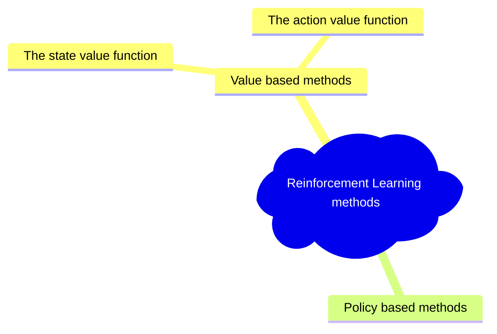

# 1 TLDR;
이 챕터의 내용을 요약해보면 다음과 같습니다.

Value-based method와 Policy based method가 존재합니다. 그 중 이 챕터에서는 value-based method를 중심으로 설명을 진행합니다. **==Value-based method란==** 각 state 또는 각 state,action pair에 대한 ==value를 계산==함으로서 Optimal policy가 무엇인지 알아내는 방법입니다. 여기서 ==가정은 Optimal value function을 통해 Optimal policy를 찾을 수 있다는 점==입니다([[#3.1 Policy와 Value-baesd의 차이점]]). 여기서 언급한 state 또는 state,action pair에 대한 value를 각각 ==state value function, action value function== 이라고 칭합니다.

==State value function과 action value function의 차이점은 두가지== 입니다. ==첫째==, 최초의 action이 주어지는지 여부입니다. action value function에서는 처음 취하는 행동이 policy와 별개로 주어집니다[^1].이와 달리 state value에서는 최초 action이 주어지지 않습니다. ==둘째==는 각 value target이 다르다는 것입니다. 가령 [[#^ec7b51 |이 그림]]을 보면 한 state에 대한 value를 계산한 것을 볼 수 있습니다. 이와 다르게 action value function에서는 각 state 중 특정 action을 취했을때의 value를 계산하고 있는것을 볼 수 있습니다([[#^cd4c33|그림]]).

[[#4 Bellman equation, simplify our value estimation | Bellman equation]]을 통해 기존의 반복되는 계산을 줄일 수 있습니다. ==기존 방식은== 각 state에서 한 episode가 끝날때 까지 계산을 계속해서 반복하게 됩니다. 다시말하면 ==이미 계산된 값을 활용하지 못하게 됩니다==. ==Bellman equation==은 마치 ==dynamic programming== 처럼 이미 계산된 값을 활용해 Value function을 정의하는 방식입니다. 그 식은 아래와 같습니다
$$
V(S_t) = R_{\text{t+1}}+\gamma*V(S_{\text{t+1}})
$$
해당 방식에 대해 State value function을 중심으로 설명했기 때문에 ==action value에 대해서도 가능한지는 아직 알 수 없습니다==.

[[#5 Monte Carlo vs Temporal Difference Learning|Monte Carlo 방식과 Temporal Difference]] 방식은 ==value function을 업데이트(학습)시키기 위해 사용되는 두가지 방식==입니다. [[#5.1 MC 에피소드가 종료될때 학습한다|Monte Carlo]]에서는 한 에피소드가 종료 될때 학습을 하게 됩니다. 즉, 한 state에서 시작해서 policy를 따라 action을 취하고, terminate state에 다다랐을 때 학습을 시행하게 됩니다. Terminate state에 다다를때 까지 얻은 reward를 종합하게 됩니다. 이를 [[#^7c91b1|식]]으로 쓰면 다음과 같습니다.
$$
V(S_t)=V(S_t)+\alpha[G_t-V(S_t)]
$$
[[#5.2 TD Learning 각 단계에서 학습|Temporal Difference Learning(이하 TD)]]에서는 Episode가 끝날때 까지 기다려서 학습을 하지 않습니다. 그 대신 다음 state가 됬을 때 바로 학습을 진행하게 됩니다. 이 말은 위의 식의 $G_t$를 구할 수 없다는 말로 볼 수 있습니다. 따라서 $G_t$를 대신할 다른 방법이 필요합니다. 이는 다음 [[#^84e52e|식]]을 이용해 대체 가능합니다. 아마도 Monte Carlo 방식을 사용하게 되면, Update까지 오랜 시간이 걸리는 문제 등을 해결한다고 볼 수 있습니다
$$
\begin{align*}
G_t = R_{t+1}+\gamma * V(S_{t+1}) \\
\therefore V(S_t) := V(S_t) + \alpha[R_{t+1}+\gamma * V(S_{t+1})-V(S_t)]
\end{align*}
$$

[[#6 Introduction to Q-learning|Q-learning]]은 TD 방식을 사용하는 off-policy, value-based 방식입니다. Q-Learning을 이야기하기 전에 Q-table에 대해 이야기 할 필요가 잇습니다. 각 (State,Action) Pair에 대해 Value를 정의할 수 있습니다(Action value). 각 state와 action이 discrete하다면 이를 table의 형태로 정리할 수 있고 이를 Q-table이라고 합니다. Q-Learning을 이용해 Q-function을 학습시키는데, 이때 각 pair를 Q-table에 정리하는 방식을 내부적으로 사용하게 됩니다. 
Q-Learning은 다음 [[#^d4466e|식]]으로 정의하게 됩니다.
$$
Q(S_t,A_t):=Q(S_t,A_t)+\alpha(R_{t+1}+\gamma max_a Q(S_{t+1},a)-Q(S_t,A_t))
$$
이 때 다음 state($S_{t+1}$)에 대한 action을 선택하는 방식이 조금 다른것을 볼 수 있습니다. 즉, 현재 State($S_{t}$)에서 action을 선택할 때는 이미 정의한 Policy를 따르는데 반해, 업데이트를 위해 ==다음 State에 대한 action을 선택할때는 또 다른 Policy(여기서는 greedy)를 사용==하는 것을 볼 수 있습니다. 이처럼 acting할때와 update할때 policy가 다른 경우를 [[#6.1.4.1 off-policy vs On-policy| off-policy]]방식이라고 합니다

# 2 목표
- Value-based methods 와 Q-Learning을 중심으로 진행함
- Q-Learning Agent를 처음부터 implementation할 것임
- Agent는 두가지 환경에서 학습 시킬 것임
	- Frozen-Lake-v1 (non-slippery version) : 특정 state(s)에서 goal state(g)로 감. 이 과정에서, Fronzen tile(F)로 걷고, 구멍(H)는 피함(아래 그림 중 우측)
	- An autonomous taxi: 도시를 누비며 승객을 A 지점에서 B 지점까지 태워다 주는 환경
- Monte Carlo와 Temporal Difference Learning(TD)의 차이를 배우게 됨

# 3 Overview

![[envs.gif]]
# 4 Two types of value-based methods
> [!tldr] state-value 방식과 action-value function
> **policy based method** : Policy를 바로 학습시키는 방법. 특정 State에 행할 action을 바로 알 수 있음
> **Value based method** : state 또는 state, action의 조합에 대한 value를 계산함. 1)Policy를 미리 정하고 Policy에 따른 action을 계속 수행하고 2)학습을 통해 state 또는 action에 대한 value를 학습시켜 간접적으로 optimal policy를 구하게 됨

**Value-based methods** 에서는 각 ==state에 대한 할인 기대 보상(expected discounted return)의 mapping function을 학습== 시키게 됨. 이 mapping function을 *==Value function==* 이라 함
![[Pasted image 20231015201408.png]]

어떤 state의 <u>할인 기대 보상</u>은 agent가 ==특정 state에서 시작해 Policy에 따라 행동할때 얻는 보상을 뜻함==.

RL Agent의 목표는 Optimal Policy $\pi^{*}$를 ==소유하는 것임==

**Optimal Policy를 찾는 방법은 두가지**방법이 존재함 
- [[Unit1 - Introduction to Deep Reinforcement Learning#Policy-Based Methods | Policy based method]] : state에서 취해야할 **==action을 바로 학습==** 시킴. 이때 value function은 없음
![[Pasted image 20231015202723.png]]
	-  따라서 우리가 Policy를 지정하는 것이 아닌 **==학습을 통해 Policy를 정의하게 됨==**

- [[Unit1 - Introduction to Deep Reinforcement Learning#Value-based method | Value based method]] : Value function은 state또는 state-action pair의 value를 내보냄. Value function을 기준으로 policy가 행동을 취함
	- Policy를 학습시키는 것이 아니기 때문에, ==Policy에 해당하는 행동==을 정의해야함
	- 예를 들어 항상 가장 큰 보상 방향으로 행동하려면 **==Greedy Policy==** 로 할 수 있음
![[Pasted image 20231015203810.png]]

어떤 경우에도 ==Policy는 가지게 됨==. Value-based에서 policy는 미리 정의한 간단한 function임

## 4.1 Policy와 Value-baesd의 차이점
다시 쓰면 이 둘의 차이점은 다음과 같음
- ==Policy-baesd== : Optimal policy($\pi^{*}$)는 학습을 통해 바로 찾게 됨
- ==Value-based== : optimal value function($Q^{*},V^{*}$)을 찾는 것이 optimal policy를 찾게 해줌
![[Pasted image 20231015205545.png]]

보통은 **==Epsilon-Greedy Policy==** 를 사용해 [[Unit1 - Introduction to Deep Reinforcement Learning#Exploitation / Exploration|exploration/exploitation trade-off]]를 다루게 됨. Value-based function에는 **==두가지가 있음==**

## 4.2 The state value function
![[Pasted image 20231016223712.png]]
state-value function에서는 한 state로 부터 시작해, Policy $\pi$를 계속 따라갔을 때 기대할 수 있는 값을 **==기대 보상==** 으로 정의함

만약 한 state에서 시작해, 한 step을 디딜때 마다 -1의 reward가 주어진다 할때 각 state의 value는 아래와 같이 정의 할 수 있음
![[Pasted image 20231016223844.png]] ^ec7b51

## 4.3 The action value function
Agent가 한 state에서 시작하고 첫 action을 취한 뒤 Policy $\pi$를 따라 행동했을 때 기대할 수 있는 보상을 기대 보상으로 정의하게 됨
![[Pasted image 20231016224041.png]]

원문에서는 제대로 설명되지는 않았지만,  *==greedy action==* 을 policy로 했다면, 기대보상이 줄어드는 방향으로 움직이지 않기 때문에 아래와 같이 모든 state를 채우는 것이 아닌, 특정 state에만 value가 표시된 것으로 보임 
![[Pasted image 20231016224219.png]] ^cd4c33

## 4.4 Value-based function의 문제점
Value-based function의 기대 보상을 계산하기 위해서는 다음 state의 모든 value를 합해야하 함. ==즉 이미 계산된 값을 다시 계산하는 불편함이 존재함.== 이와 같은 반복 계산 문제를 해결하는 것이 [[#Bellman equation, simplify our value estimation | Bellman equation]]임

# 5 Bellman equation, simplify our value estimation
> [!tldr] 강화학습게의 Dynamic programming
> Dynamic programming은 이미 계산된 값을 기록(memo)하고 다시 꺼내 씀으로써 계산을 줄여주는 방식이다. 이와 유사하게 bellman equation에서는 현재 state의 value를 즉시 받는 보상과, 다음 state의 value를 할인한 것으로 정의하기 때문에 훨씬 효율적인 계산이 가능하다

## 5.1 지루한 기존 방식
> 매 State에 대해 Goal 까지의 value를 매번 계산함

지금까지 방식은 한 State의 Value$V(S_t)$를 계산하기 위해서는 해당 state에서 policy를 따라 움직일때 기대보상을 다 더해야 했음(여기서 policy를 greedy라고 정의함). 이 과정을 그림으로 표현하면 아래와 같음

![[Pasted image 20231016231012.png |350]]![[Pasted image 20231016231230.png|350]]

위 그림에서 볼 수 있듯, 한 State의 Value를 계산하기 위해서는 Goal까지의 State를 Policy를 따라 움직여야 함. 그리고, $V(S_\text{t+1})$에 대해 계산할때도 마찬가지로 Goal 까지 모든 State를 Policy를 따라 움직여 계산하게 됨

## 5.2 Bellman Equation을 통한 빠른 계산

$Reward = R_{\text{t+1}}+\gamma*V(S_{\text{t+1}})$ 로 정의할 수 있음

![[Pasted image 20231016234938.png]]

즉 reward를 계산하기 위해, Goal State까지의 계산을 반복하는 것이 아닌, immedate reward와 다음 state의 reward의 합을 할인한 값으로 나타냄

아래 두 그림을 통해 효율성의 차이를 볼 수 있음

![[Pasted image 20231016235050.png|350]]![[Pasted image 20231016235103.png|350]]

위의 오른쪽 경우를 식으로 다시 쓰면 아래와 같음

$V(S_t) = R_{\text{t+1}}+\gamma*V(S_{\text{t+1}})$

위에서 개념을 간단하기 위해서 $\gamma=1$로 진행함(Discount 없음)

# 6 Monte Carlo vs Temporal Difference Learning
Value function을 학습시키는 두가지 방식으로 이해하면 된다. Experience를 이용해 학습시킨다는 것이 동일한 점이다. 간략히 설명하면 Monte carlo(이하 MC)방법을 사용하면 episode의 모든 경험을 통해 학습하게 되고 반면에 Temporal Difference(TD)를 사용하기 되면 한 step($S_{t},A_{t},R_{\text{t+1}},S_{\text{t+1}}$)의 결과만 이용하게 된다.

## 6.1 MC : 에피소드가 종료될때 학습한다
MC 방법은 한 에피소드가 끝날때 까지 기다려야하며 $G_{t}$를 $V(S_{t})$의 업데이트 타겟으로 삼는다.

$V(S_t)=V(S_t)+\alpha[G_t-V(S_t)]$ ^7c91b1

예시를 통해 MC를 이해하면 아래와 같다. 이때 아래와 같은 상황을 가정한다
![[Pasted image 20231020061453.png]]
- 항상 시작지점에서 시작한다
- Agent(여기서는 쥐)는 Policy에 따라 행동한다
- 행동을 취하면 reward와 다음 상태를 얻게 된다
- 10번을 넘게 움직이면 이거나 고양이가 있는 위치에 다다르면 에피소드가 종료된다
- 애피소드가 끝나는 시점에 다음과 [(State,Action,Reward,Next Sate)]의 `tuple list`를 가지게 됨
- 위 `tuple list`를 이용해 $G_t$를 계산하고 $V(S_t)$를 업데이트 한다
위 내용을 그림으로 살펴보면 아래와 같다
![[Pasted image 20231020061937.png]]

더 구체적인 예로 아래와 같은 경우를 들 수 있다
- 모든 value function을 0으로 초기화 한다
- Learning rate(lr)를 0.1, discount rate를 1로 설정한다 ^85b7fe
- 쥐는 주어진 environment를 탐험한다

아래 그림은 10회 초과 탐색을 진행했을때 모습이다
![[Pasted image 20231020062156.png]]

위 그림을 기반으로 $G_t$를 계산해보면 아래와 같다
- $G_0=1+0+0+0+0+0+1+1+0+0$
- $G_0=3$
- lr은 0.1, discount rate는 1을 이용해 계산을 하면 다음과 같다([[#^85b7fe|lr설정부분 참조]])
- Monte Carlo 식을 이용해 계산하면 다음과 같이 풀 수 있다([[#^7c91b1 | Monte carlo equation]])
- $V(S_t)=V(S_t)+\alpha[G_t-V(S_t)]$
- $V(S_t)=0+0.1*(3-0)$
- $V(S_t)=0.3$

## 6.2 TD Learning : 각 단계에서 학습
> [!tldr] $G_t = R_{t+1}+\gamma * V(S_{t+1})$
> 위 [[#MC 에피소드가 종료될때 학습한다 | MC]]에서는 한 ==에피소드가 끝날때 업데이트== 를 시행했다. 나중에 이유를 설명하게 되겠지만, 한 에피소드가 아닌 한 스탭마다 업데이트를 시행하는 방식이 있다. ==이를 TD 방식이라 한다==. TD 방식은 기존의 $G_t$를 다른 식으로 정의했다는 것으로 이해할 수 있다.

TD에서는 한 스탭을 이용해 TD Target을 정의 해서 $V(S_t)$를 업데이트 한다. 이때 사용되는 값은 $R_{t+1}$과 $\gamma * V(S_{t+1})$이다. [[#MC 에피소드가 종료될때 학습한다 | MC]]에서는 모든 한 Episode를 끝내서 $G_{t}$를 계산했다. 하지만 TD에서는 한 스탭마다 학습하도록 했기 때문에 $G_t$를 추정하는 방식이 필요하다. 달리말하면 [[#^7c91b1 | Monte carlo equation]] 중 $G_t$부분을 다음의 식으로 변환한 것과 동일한 내용을 가진다.

$G_t = R_{t+1}+\gamma * V(S_{t+1})$ ^84e52e

위 내용을 원래 식에 적용해보면 다음과 같다
$$
\begin{align*}
V(S_t) = V(S_t)+\alpha[G_t-V(S_t)] \\
= V(S_t)+\alpha[R_{t+1}+\gamma * V(S_{t+1})-V(S_t)] \\ \\
\because G_t = R_{t+1}+\gamma * V(S_{t+1}) \\
\end{align*} 
$$
위 경우는 다음 한 스탭을 디딜때 update를 하게 되는데 이를  ==TD(0)== 방법이라고 이야기 한다

이 내용을 예시를 통해 이해해보면 다음과 같다
![[Pasted image 20231021102829.png]]

- 위 상항에서 모든 State를 0으로 초기화 한다.
- Learning Rate(lr)을 0.1, discount rate = 1로 설정한다
- 쥐는 Random action을 취한다. 여기서는 Random을 통해 왼쪽으로 움직였다고 가정한다
- 왼쪽에는 치즈가 있기 때문에 $R_{t+1}=1$이 된다

이를 식으로 풀어보면 아래와 같다

$$
\begin{align*}
V(S_t) = V(S_t)+\alpha[R_{t+1}+\gamma * V(S_{t+1})-V(S_t)] \\
= 0 +0.1*(1+1*0-0)\\
= 0.1
\end{align*} 
$$
# 7 Introduction to Q-learning
Q- learning 이란?
	[[#TD Learning 각 단계에서 학습 | TD]]를 사용하는 [[#6.1.4.1 off-policy vs On-policy|off-policy]] [[#Two types of value-based methods | value-based ]]방식이다. Off-policy에 대한 설명은 이후에 이어진다. ==Q-learning은 Q-function==을 학습시키는 알고리즘이다. 이 Q-function을 이용해 특정 state에서 특정 action을 취했을때 value를 얻을 수 있다. ==즉, 어떤 상태에서 어떤 행동을 취하는게 보상이 큰지 정의하게 된다.== 그리고 여기서 Q는 Quality에서 따온 말이다

![[Pasted image 20231021104925.png]]

Q-learning을 통해 학습된 Q-function의 value Q-table에 정리가 된다. 이 Q-table을 cheat sheet처럼 사용해 Q-function의 value를 가져오고 Q-function을 업데이트 하는 등에 사용된다

아래 예제를 통해 이해해보면 이렇다
![[Pasted image 20231021105446.png]]

6가지의 state가 존재하고, 4가지 action(왼쪽,오른쪽,위,아래) 각 state에서 행할 수 있는 action은 4가지 이기 때문에 이를 table(Q-table)로 만들면 아래와 같이 볼 수 있다.

![[Pasted image 20231021105556.png]]
예를들어 쥐가 있는 위치에서 위로 간다는 action에 해당하는 Q-function은 아래와 같이 볼 수 있다

![[Pasted image 20231021105615.png]]

다시 정리하면 Q-table내에 Q-function의 각 (state,action)의 value가 정리되며, Q-function은 Q-table을 이용해 업데이트를 시행한다

*Q-Learning*을 다시 정리해보면 아래와 같다.
- Q-function(action value function)을 학습시킨다. 이때 내부적으로 Q-table을 이용하 각 state,action에 대한 Value(=Q-function)을 가지고 있는다
- 특정 state, action이 주어지면 Q-table을 이용해 이에 대응되는 value를 가져온다
- 학습이 끝나면 Optimal Q-function을 가지게 되며, 이는 Optimal Q-table을 가지고 있다는 뜻임
- Optimal Q-function을 가진다면 Optimal policy를 가졌다는 것과 동일한 뜻임. 왜냐하면 각 state에서 행해야할 최선의 action을 알고 있다는 뜻이기 때문임
 
![[Pasted image 20231021123338.png]]

Q-table에 최초로 써있는것은 무쓸모지만, 업데이트를 할 수록 Optimal value에 가까워짐

![[Pasted image 20231021123539.png]]

## 7.1 The Q-Learning algorithm
> $Q(S_t,A_t):=Q(S_t,A_t)+\alpha(R_{t+1}+\gamma max_a Q(S_{t+1},a)-Q(S_t,A_t))$

^d4466e

Pseudo code 
![[Pasted image 20231021123701.png]]

### 7.1.1 Q-table을 초기화 함
여기에서는 모두 0으로 초기화함

![[Pasted image 20231021123734.png]]

### 7.1.2 Epsilon-greedy를 이용해 action을 선택함

![[Pasted image 20231021123839.png]]

Epsilon-greedy를 이용해 exploration/exploitation trade-off를 다루게된다. 최초에 Epsilon을 1로 설정한 후(Exploration), 학습을 진행함에 따라 0(Exploitation)으로 줄여나가게 된다. 이런방법을 통해 결과적으로 Q-table의 approximation값이 더 좋아짐

![[Pasted image 20231021124409.png]]

### 7.1.3 Action At, reward Rt+1, next state St+1
![[Pasted image 20231021124755.png]]

### 7.1.4 Update Q(St,At)

![[Pasted image 20231021125050.png]]

- $S_t,A_t,R_{t+1},S_{t+1}$
- TD Target을 구하기위해서는 Action($A_t$)를 통해 구한 $R_{t+1},S_{t+1}$을 이용하게 됨.
	- 이 중 $S_{t+1}$에 대한 최적의 action에 greedy policy를 사용함. 이 부분에서 Policy의 차이를 볼 수 있음. 즉, action을 취할때는 episilon을 쓰지만 update를 할때는 greedy를 사용하게 됨

#### 7.1.4.1 off-policy vs On-policy

^2e9b29

둘의 차이는 미묘하지만 아래와 같이 정리할 수 있음
> [!quote] acting을 할때와 update를 할때 사용하는 Policy가 다른 경우

#### 7.1.4.2 On-Policy
> Update와 acting하는 경우 policy가 같은 경우

![[Pasted image 20231021130811.png]]

# 8 A Q-Learning example
![[Pasted image 20231021131212.png]]
**가정**
- 위 미로에서 항상 같은 지점에서 시작한다
- 목표는 오른쪽 하단에 있는 치즈 덩어리를 먹는 것이다
- 한 에피소드는 독을 먹거나, 치즈 덩어리를 먹으면 끝난다
- Learning rate는 0.1로 설정한다
- discount rate = 0.99로 설정한다

**보상**
보상은 다음과 같이 정의한다
- +0: 치즈가 없는 위치로 갈때
- +1 : 작은 치즈가 있는 곳으로 갈 때
- +10 : 치즈 덩어리가 있는곳에 도착할 때
- -10 : 독이 있는 곳에 도착할 때
- +0 : 5 스탭 이상 움직일때(이건?)

**알고리즘**
- Q-Learning algorithm

## 8.1 Step 1 : Q-table을 초기화함

![[Pasted image 20231021131742.png]]

timestep 1에서 시작하면

## 8.2 Step 2: Epsilon greedy를 이용해 action을 선택함
Epsilon=1인 상태기 때문에, 랜덤 액션을 취하게 됨.오른쪽으로 간다고 가정함
![[Pasted image 20231021131941.png]]

## 8.3 Step 3: Action At를 행하고, Rt+1과 St+1을 얻음
치즈가 있는 위치로 이동하기 때문에 +1 리워드를 얻게 됨

![[Pasted image 20231021132046.png]]

## 8.4 Step 4 : Update Q(St, At)
[[#^d4466e|식]]을 이용해 update를 할 수 있음

![[Pasted image 20231021133202.png]]

Training timestep2로 넘어가게 됨

## 8.5 Step 2: Epsilon greedy를 이용해 action을 선택함
이제 epsion=0.99이지만 여전히 큰 값이기 때문에 random action을 취하게 됨. 아래로 움직이게 되면 아래와 같이 진행되게 됨

![[Pasted image 20231021133438.png]]

## 8.6 Step 3: Action At를 행하고, Rt+1과 St+1을 얻음
$R_{t+1}=-10$이 되고 terminate state가 됨

![[Pasted image 20231021133554.png]]

## 8.7 Step 4 : Update Q(St, At)
![[Pasted image 20231021133620.png]]

# 9 Study Question

> [!question] 더 공부해 보기
> 1. 위 value-based function에서 보면 마치 , $S_{\text{t+1}}$이 Goal 방향으로 이어질 것처럼 그려진 것으로 보임. 만약 다음 $S_{\text{t+1}}$이 다른 방향으로 가도, 위와같은 그림이 나오는가? 아니면 일종의 greedy action이 기 정의되어 있기 때문에 신경 쓸 필요가 없는 것인가?
> 	1. 신경 쓸 필요가 없다고 하기엔 논리적 모순이 있어보임. 왜냐하면 실제 goal에 다다르기 전까지는 해당 방향이 goal에 다다르는 방향인지 알 수 없기 때문에 greedy로 정해놓았다해도 바로 해당 state의 value를 알 수 없을 것으로 보임
> 	2. 따라서 몇번의 과정을 통해 각 state를 계산하는 과정이 있을 것으로 보임. 이는 책에서도 나왔던 부분으로 기억함
> 2. [[#Bellman equation, simplify our value estimation]]에서 Study Question(Huggin face에서 주어진 질문)
> 	1. 만약 $\gamma$가 작아지거나(0,0.01) 큰것은 어떤 의미를 가지는가?
> > [!done] $\gamma$ 가 크면 Long-term, $\gamma$ 가 작으면 Short-term
> > $\gamma$가 작다면 즉각적인 보상에 oriented된 value function이 되고, $\gamma$가 크면 Long-term reward도 고려하는 모델이 됨
> > 예) 자율주행 차. 바로 앞에서 일어나는 일을 처리하는데 orient 또는 long-term의 기대보상에 따라 움직이는 자율주행 agent
> 3. TD에 대한 부분이 책에서는 TD(0)라고 쓰여있던데, 이 차이를 한번 확인해 볼 필요가 있음
> > [!done] TD(0)는 1 step에서 업데이트를 하는 방식
> 4. Q-table에 저장되는것은 Q-function인가 value인가
> 	1. Value가 더 맞는거 같다. Q-function은 하나로 정의되어 있으니까
> 5. 여기서 Monte Carlo는 어떤 방식인가?
> 	1. [[CH5 Monte Carlo Methods#3 Monte Carlo Prediction]]를 보면 first-visit MC method로 보임

# 10 Further Study
직접 짜보자
[[My Q-Learning]]

[^1]:_State Value (V) and Action Value ( Q Value ) Derivation - Reinforcement Learning - Machine Learning_, (2020). Accessed: Oct. 21, 2023. [Online Video]. Available: [https://www.youtube.com/watch?v=n6qchXOII2g](https://www.youtube.com/watch?v=n6qchXOII2g)

#ReinforcementLearning  #value-basedFunction #Q-learning #MonteCarlo #TemporalDifference