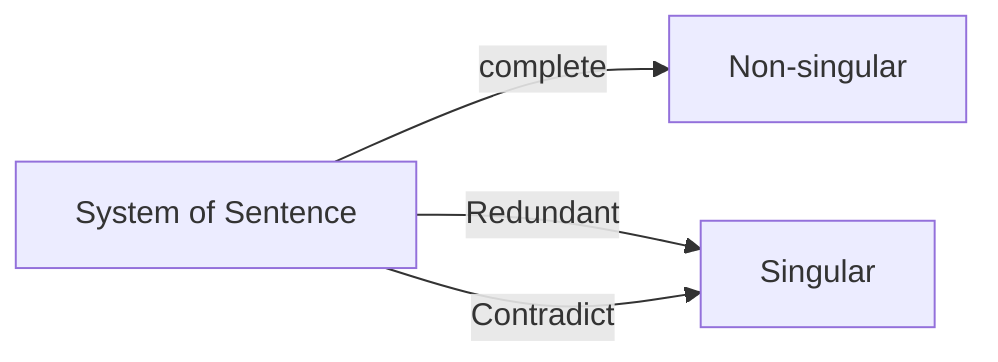

---
category:
  - math
---

# 이 코스의 다른점
수학 뿐만 아니라 Python code도 할 것임

# Introduction
실제 상황을 Matrix로 표현하게 됨. Singularity 등
Week 2 - 2 by 2, 3by 3, Rank 등
Week 3 - Vector
Week 4 - Eigen vector

pre-requisite
- 간단한 수학 및 plot
	- 1 variable math
	- 2d plot
- Basic Algebra를 알고 있으면 됨

# System of sentences
> [!tldr] Complete / Redundant / Contradictory
> 일상적인 문장을 이용해 각 변수가 해결 가능한 문제인지 보여줌
> 해결 가능한 complete를 Non-singular
> 같은 내용이 반복되거나 모순되는 경우는 Singular case에 해당함

## Complete
- The dog(b) is **black**
- The cat(c) is **orange**
	- 위 문장은 각 변수(동물)를 계산 할 수 있음

## Redundant
- The dog is **black**
- The dog is **black**
	- 두 변수(문장)는 동일하기 때문에 문제를 풀 수 없음

## Contradictory
- The dog is black
- The dog is white
	- 두 문장은 모순됨

# System of equations
> [!tldr] Complete / Redundant / Contradict
> 앞서 문장을 통해 문제를 해결하는 방법을 보여줌.여기에서는 위 문장을 수학식으로 정의하고 해결 방법을 보여줌

## Complete
- $a+b=10$
- $a+2b=12$
	- $a=8,b=2$
	- `Non-singular`
![[01_no_single.png | 400]]

## Redundant
- $a+b=10$
- $2a+2b=20$
	- 무한히 많은 해답이 존재함
	- `Singular`
![[02_red_single.png |400]]
## Contradictory
- $a+b=10$
- $2a+2b=24$
	- 모순되기 때문에 답이 존재하지 않음
	- `Singular`
![[03_cnt_single.png | 400]]

# Linear Equation
> [!tldr] 선으로 표현 가능 한 식(2D)
> 선형 식은 좌표에 선으로 표현 가능함

# System of equation as Line
- 변수가 두개인 matrix는 2d space의 Line으로 표현 가능 함

# Geometrical meaning of Singularity
- Linear equatuon이 Singular 
	- Inifite or No solution
		- 즉, 두 선이 평행하거나 겹쳐있는 경우를 뜻함
- Non-Singular
	- 두 선이 평행하지 않음을 뜻함

# Linearly dependant rows and Determinant
> [!tldr] 2\*2 matrix와 determinant
> 2\*2matrix의 determinant를 이용해 각 row가 linear dependent 한지 알 수 있음. 다시말해 linearly dependent 하면 해답이 무한하거나, 없음(singular) 

- Linearly dependant row는 `2*2` matrix에서 한 row가 다른 row의 k배가 된다는 것을 뜻함
- 해당 속성을 이용하면 $ad-bc=0$ 인 경우 해답을 찾을 수 없음을 알게됨
- $$\begin{bmatrix}a & b \\ c &d\\\end{bmatrix} \text{in linear dependeant rows, } c=ka, d=kb$$
- $k = a/c = d/b -> ad=bc -> ad-bc=0$

> [!attention] Study question
> 1. Determinant는 n 정사각 행렬에 대해서 구할 수 있는 값인가?
> 	1. 그렇다면 n 정사각 행렬의 linear dependancy를 판별하기는 쉬운일
> 	2. 아니라면 그 외의 행렬은 어떻게 처리 되는가?
> 		1. **==가로로 긴 행렬은 생각해보면 이미 문제를 풀기위한 충분한 정보가 부족함==**
> 			1. $$\begin{bmatrix}a & b & c \\ d & e & f \\\end{bmatrix}$$
> 		2. 세로로 긴 행렬의 경우 중복되는 정보 또는 모순 될 수 있음을 뜻한다 볼 수 있음
> 			1. $$\begin{bmatrix}a & b  \\ c & d \\ e & f \\\end{bmatrix}$$
# 3by 3 matrix
> [!tldr] Singular하면 답을 구할 수 없다
> 한 row가 다른 row의 linear combination인 경우 singular함. Singular한 경우 해답은 무한히 많거나, 존재하지 않음
> singularity를 계산할때는 constant(우변의 값)은 중요하지 않음

- 예)
- $$\begin{bmatrix}1 & 1 &1 \\ 1 & 2 & 1 \\ 1 & 1 & 2\\\end{bmatrix} \begin{bmatrix}1 & 1 &1 \\ 1 & 1 & 2 \\ 1 & 1 & 3\\\end{bmatrix} \begin{bmatrix}1 & 1 &1 \\ 2 & 2 & 2 \\ 3 & 3 & 3\\\end{bmatrix}$$
- 첫번째 식은 답이 있고 나머지는 해답이 존재하지 않음

# Determinant of 3 by 3 matrix
- 3 by 3 메트릭스의 determinant는 다음과 같이 구할 수 있음
-  $$\begin{bmatrix}a & b &c \\ d & e & f \\ g & h & i\\\end{bmatrix} -> aei+bfg+cdh-ceg-bdi-ahf$$

> [!warning] study question
> - 위 메트리스의 디터미넌트는 어떻게 유도되는가?
> 	- hint: 각 row 중 어느 한 관계라도 Linear dependent하다 -> 각 row별 Determinant를 곱하면 0이 된다
> 

# [[Week1 - Numpy part]]

#LinearAlgebra #deeplearningAI #numpy 
